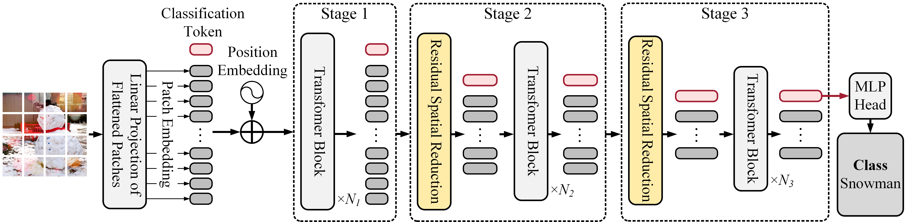
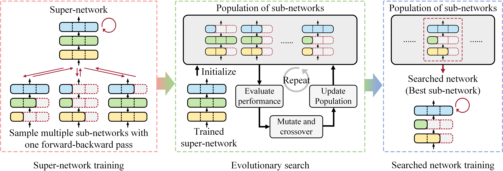

# Searching for Efficient Multi-Stage Vision Transformers

This repository contains the official Pytorch implementation of "Searching for Efficient Multi-Stage Vision Transformers" 
and is based on [DeiT](https://github.com/facebookresearch/deit) and [timm](https://github.com/rwightman/pytorch-image-models).

<p align="center">
	
</p>

<p align="center">
Illustration of the proposed multi-stage ViT-Res network.
</p>

<br />

<p align="center">
	
</p>

<p align="center">
Illustration of weight-sharing neural architecture search with multi-architectural sampling.
</p>

<br />

<p align="center">
	
</p>

<p align="center">
Accuracy-MACs trade-offs of the proposed ViT-ResNAS. Our networks achieves comparable results to previous work.
</p>


## Content ##
0. [Requirements](#requirements)
0. [Data Preparation](#data-preparation)
0. [Pre-Trained Models](#pre-trained-models)
0. [Training ViT-Res](#training-vit-res)
0. [Performing Neural Architecture Search](#performing-neural-architecture-search)
0. [Evaluation](#evaluation)


## Requirements ##

The codebase is tested with 8 V100 (16GB) GPUs.

To install requirements:

```
    pip install -r requirements.txt
```

Docker files are provided to set up the environment. 
Please run:
```
    cd docker

    sh 1_env_setup.sh
    
    sh 2_build_docker_image.sh
    
    sh 3_run_docker_image.sh
``` 

Make sure that the configuration specified in `3_run_docker_image.sh` is correct before running the command.


## Data Preparation ##

Download and extract ImageNet train and val images from http://image-net.org/.
The directory structure is the standard layout for the torchvision [`datasets.ImageFolder`](https://pytorch.org/docs/stable/torchvision/datasets.html#imagefolder), and the training and validation data is expected to be in the `train/` folder and `val` folder respectively:

```
/path/to/imagenet/
  train/
    class1/
      img1.jpeg
    class2/
      img2.jpeg
  val/
    class1/
      img3.jpeg
    class/2
      img4.jpeg
```


## Pre-Trained Models ##

Pre-trained weights of super-networks and searched networks can be found [here](https://www.dropbox.com/sh/x3momdvo7dkyv4o/AAB5orUSm7aWk6wQM_QFcKDsa?dl=0).


## Training ViT-Res ##

To train ViT-Res-Tiny, modify `IMAGENET_PATH` in `scripts/vit-sr-nas/reference_net/tiny.sh` and run:
```
    sh scripts/vit-sr-nas/reference_net/tiny.sh 
```

We use 8 GPUs for training.
Please modify numbers of GPUs (`--nproc_per_node`) and adjust batch size (`--batch-size`) if different numbers of GPUs are used. 


## Performing Neural Architecture Search ##

### 0. Building Sub-Train and Sub-Val Set

Modify `_SOURCE_DIR`, `_SUB_TRAIN_DIR`, and `_SUB_VAL_DIR` in `search_utils/build_subset.py`, and run:
```
    cd search_utils
    
    python build_subset.py
    
    cd ..
```


### 1. Super-Network Training

Before running each script, modify `IMAGENET_PATH` (directed to the directory containing the sub-train and sub-val sets).

For ViT-ResNAS-Tiny, run:
```
    sh scripts/vit-sr-nas/super_net/tiny.sh
```

For ViT-ResNAS-Small and Medium, run:
```
    sh scripts/vit-sr-nas/super_net/small.sh
```


### 2. Evolutionary Search

Before running each script, modify `IMAGENET_PATH` (directed to the directory containing the sub-train and sub-val sets) and `MODEL_PATH`.


For ViT-ResNAS-Tiny, run:
```
    sh scripts/vit-sr-nas/evolutionary_search/tiny.sh
```

For ViT-ResNAS-Small, run:
```
    sh scripts/vit-sr-nas/evolutionary_search/small_mac@2.9G.sh
```

For ViT-ResNAS-Medium, run:
```
    sh scripts/vit-sr-nas/evolutionary_search/medium_mac@4.6G.sh
```

After running evolutionary search for each network, see `summary.txt` in output directory and modify `network_def`.

For example, the `network_def` in `summary.txt` is `((4, 220), (1, (220, 5, 32), (220, 880), 1), (1, (220, 5, 32), (220, 880), 1), (1, (220, 7, 32), (220, 800), 1), (1, (220, 7, 32), (220, 800), 0), (1, (220, 5, 32), (220, 720), 1), (1, (220, 5, 32), (220, 720), 1), (1, (220, 5, 32), (220, 720), 1), (3, 220, 440), (1, (440, 10, 48), (440, 1760), 1), (1, (440, 10, 48), (440, 1440), 1), (1, (440, 10, 48), (440, 1920), 1), (1, (440, 10, 48), (440, 1600), 1), (1, (440, 12, 48), (440, 1600), 1), (1, (440, 12, 48), (440, 1120), 0), (1, (440, 12, 48), (440, 1440), 1), (3, 440, 880), (1, (880, 16, 64), (880, 3200), 1), (1, (880, 12, 64), (880, 3200), 1), (1, (880, 16, 64), (880, 2880), 1), (1, (880, 12, 64), (880, 3200), 0), (1, (880, 12, 64), (880, 2240), 1), (1, (880, 12, 64), (880, 3520), 0), (1, (880, 14, 64), (880, 2560), 1), (2, 880, 1000))`.

Remove the element in the tuple that has `1` in the first element and `0` in the last element (e.g. `(1, (220, 5, 32), (220, 880), 0)`).

This reflects that the transformer block is removed in a searched network.

After this modification, the `network_def` becomes `((4, 220), (1, (220, 5, 32), (220, 880), 1), (1, (220, 5, 32), (220, 880), 1), (1, (220, 7, 32), (220, 800), 1), (1, (220, 5, 32), (220, 720), 1), (1, (220, 5, 32), (220, 720), 1), (1, (220, 5, 32), (220, 720), 1), (3, 220, 440), (1, (440, 10, 48), (440, 1760), 1), (1, (440, 10, 48), (440, 1440), 1), (1, (440, 10, 48), (440, 1920), 1), (1, (440, 10, 48), (440, 1600), 1), (1, (440, 12, 48), (440, 1600), 1), (1, (440, 12, 48), (440, 1440), 1), (3, 440, 880), (1, (880, 16, 64), (880, 3200), 1), (1, (880, 12, 64), (880, 3200), 1), (1, (880, 16, 64), (880, 2880), 1), (1, (880, 12, 64), (880, 2240), 1), (1, (880, 14, 64), (880, 2560), 1), (2, 880, 1000))`.

Then, use the searched `network_def` for searched network training.


### 3. Searched Network Training

Before running each script, modify `IMAGENET_PATH`.

For ViT-ResNAS-Tiny, run:
```
    sh scripts/vit-sr-nas/searched_net/tiny.sh
```

For ViT-ResNAS-Small, run:
```
    sh scripts/vit-sr-nas/searched_net/small_mac@2.9G.sh
```

For ViT-ResNAS-Medium, run:
```
    sh scripts/vit-sr-nas/searched_net/medium_mac@4.6G.sh
```


### 4. Fine-tuning Trained Networks at Higher Resolution

Before running, modify `IMAGENET_PATH` and `FINETUNE_PATH` (directed to trained ViT-ResNAS-Medium checkpoint).
Then, run:
```
    sh scripts/vit-sr-nas/finetune/medium_img-size@392.sh
```

To fine-tune at different resolutions, modify `--model`, `--input-size` and `--mix-patch-len`.
We provide models at resolutions 280, 336, and 392 as shown in [here](nets/vit_sr_supernet.py#L553-L577).
Note that `--input-size` must be equal to "56 * `--mix-patch-len`" since the spatial size in ViT-ResNAS is reduced by 56X.


## Evaluation ##
Before running, modify `IMAGENET_PATH` and `MODEL_PATH`.
Then, run:
```
    sh scripts/vit-sr-nas/eval/small_mac@2.9G.sh
```


## Questions ##

Please direct questions to Yi-Lun Liao (ylliao@mit.edu).


## License ##
This repository is released under the CC-BY-NC 4.0. license as found in the [LICENSE](LICENSE) file.
